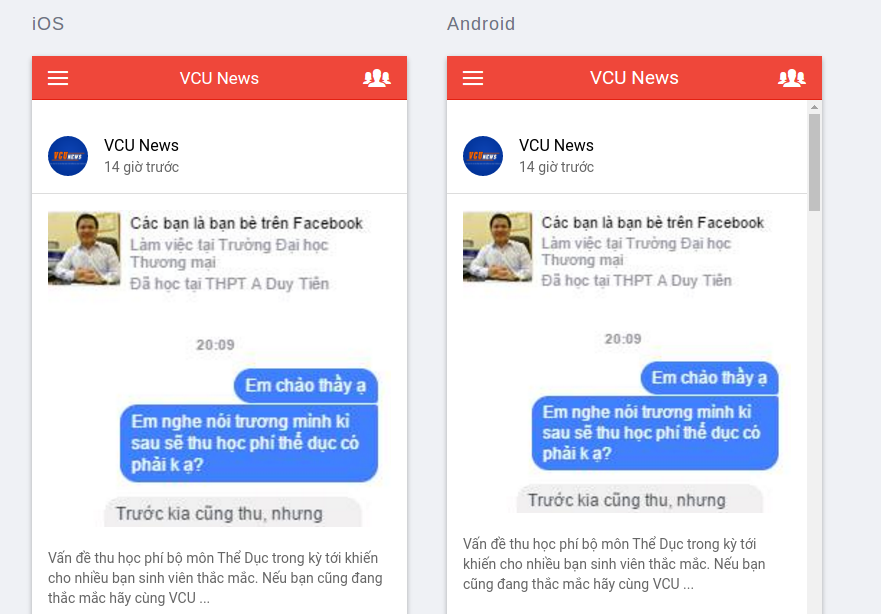
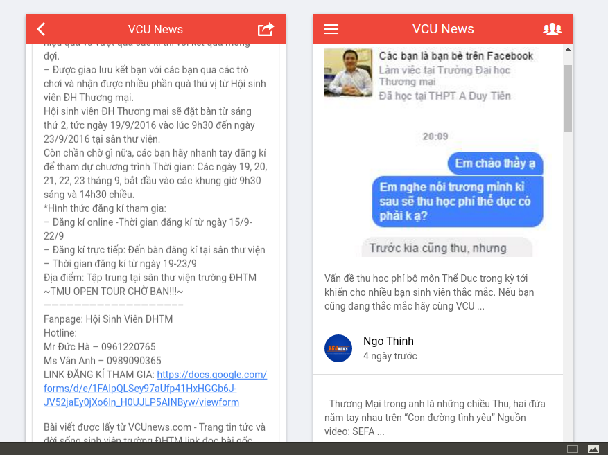

# VCUNews RSS Feeder Application 

This is a simple demo of Ionic with configured gulp & bower.

## Important!
**There is not an actual Ionic Conference at this time.** This project is just to show off Ionic 2 components in a real-world application. Please go through the steps in [CONTRIBUTING.md](https://github.com/driftyco/ionic-conference-app/blob/master/.github/CONTRIBUTING.md) before submitting an issue.

## Getting Started

* Clone this repository.
* Run `npm install` from the project root.
* Install the ionic CLI (`npm install -g cordova ionic`)
* Run `ionic serve` in a terminal from the project root.
* Profit

**Note:** Is your build slow? Update `npm` to 3.x: `npm install -g npm`.

## App Preview

All app preview screenshots were taken by running `ionic serve --lab`.

- [Main Page]

  

- [View Detail Article Page]

  

